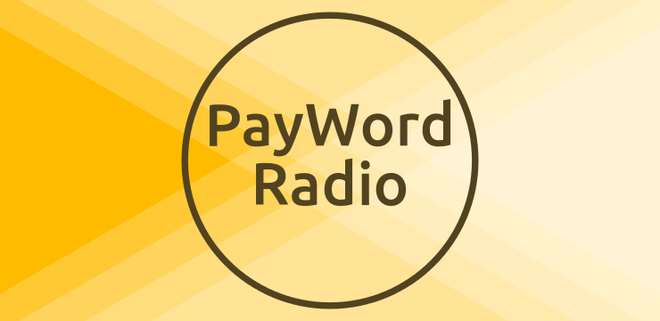

# This repository has been moved to [gitlab.com/paul-nechifor/payword-radio](http://gitlab.com/paul-nechifor/payword-radio).

Old readme:

# PayWord Radio

An implementation of the [PayWord micropayment scheme][1] as an audio streaming
payment method. PayWord is an efficient and secure way to do many small
payments, in this case paying for seconds of received audio files.

This was one of my homeworks for the [Information Security][2] course.

This project is written in Java and can be run as three different roles:

* a **broker** who manages the money and is trusted;
* a **vendor** which sends audio data and expects to be payed;
* a GUI **client** which can connect to a vendor to receive and play audio data
and pays for it.

## Build it

Compile everything in a single binary:

    mvn clean compile assembly:single

## Run it

Run this to see the options:

    java -jar target/payword-radio.jar

## License

MIT

[1]: http://people.csail.mit.edu/rivest/RivestShamir-mpay.pdf
[2]: http://www.infoiasi.ro/bin/Programs/CS3102_11
